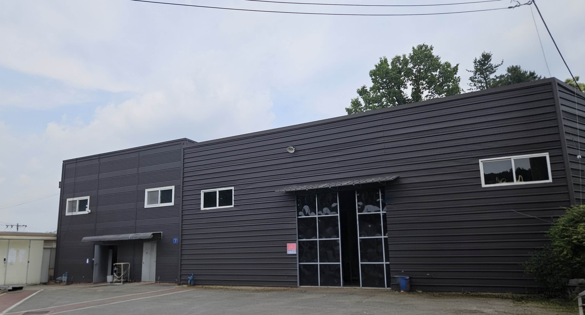
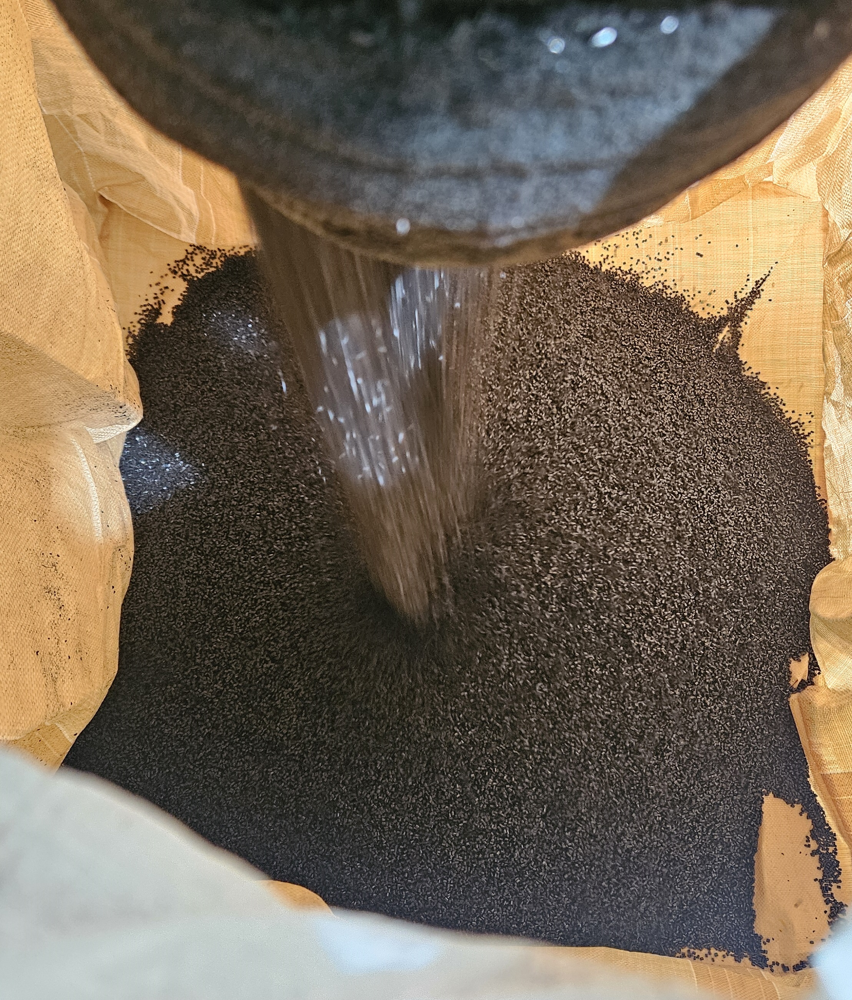
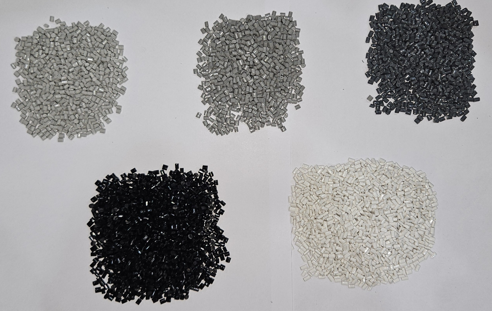
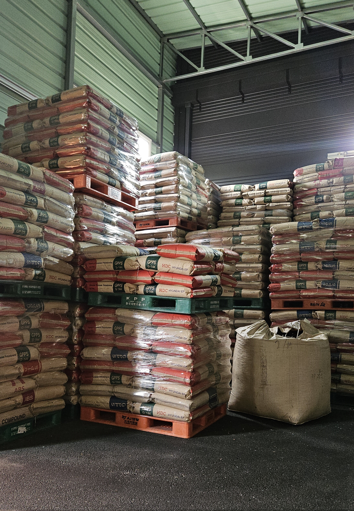

```html
<!DOCTYPE html>
<html lang="ko">
<head>
    <meta charset="UTF-8">
    <meta name="viewport" content="width=device-width, initial-scale=1.0">
    <title>대선케미칼 - ABS원료 제조 전문기업</title>
    <link href="https://fonts.googleapis.com/css2?family=Noto+Sans+KR:wght@300;400;500;700&display=swap" rel="stylesheet">
    <link rel="stylesheet" href="https://cdnjs.cloudflare.com/ajax/libs/font-awesome/6.0.0-beta3/css/all.min.css">
    <style>
        /* 기본 스타일 */
        * {
            margin: 0;
            padding: 0;
            box-sizing: border-box;
            font-family: 'Noto Sans KR', sans-serif;
        }
        
        body {
            line-height: 1.6;
            color: #333;
            background-color: #f8f9fa;
            overflow-x: hidden;
        }
        
        .container {
            max-width: 1200px;
            margin: 0 auto;
            padding: 0 20px;
            width: 100%;
        }
        
        /* 헤더 스타일 */
        header {
            background-color: #1a4b8c;
            color: white;
            padding: 20px 0;
            position: fixed;
            width: 100%;
            top: 0;
            z-index: 1000;
            box-shadow: 0 2px 10px rgba(0, 0, 0, 0.1);
        }
        
        .header-content {
            display: flex;
            justify-content: space-between;
            align-items: center;
        }
        
        .logo h1 {
            font-size: 24px;
            font-weight: 700;
        }
        
        nav ul {
            display: flex;
            list-style: none;
        }
        
        nav ul li {
            margin-left: 30px;
        }
        
        nav ul li a {
            color: white;
            text-decoration: none;
            font-weight: 500;
            transition: color 0.3s;
        }
        
        nav ul li a:hover {
            color: #a8c6fa;
        }
        
        /* 모바일 메뉴 */
        .menu-toggle {
            display: none;
            background: none;
            border: none;
            color: white;
            font-size: 24px;
            cursor: pointer;
        }
        
        /* 메인 배너 */
        .hero {
            background: linear-gradient(rgba(0, 0, 0, 0.5), rgba(0, 0, 0, 0.5)), url('https://source.unsplash.com/random/1600x900/?factory,chemical') no-repeat center center/cover;
            height: 100vh;
            display: flex;
            align-items: center;
            text-align: center;
            color: white;
            margin-top: 60px;
        }
        
        .hero-content {
            max-width: 800px;
            margin: 0 auto;
            padding: 0 20px;
        }
        
        .hero h2 {
            font-size: 48px;
            margin-bottom: 20px;
        }
        
        .hero p {
            font-size: 20px;
            margin-bottom: 30px;
        }
        
        .btn {
            display: inline-block;
            background-color: #1a4b8c;
            color: white;
            padding: 12px 30px;
            border-radius: 5px;
            text-decoration: none;
            font-weight: 600;
            transition: background-color 0.3s;
        }
        
        .btn:hover {
            background-color: #0d3b76;
        }
        
        /* 섹션 공통 스타일 */
        section {
            padding: 100px 0;
        }
        
        .section-title {
            text-align: center;
            margin-bottom: 60px;
        }
        
        .section-title h2 {
            font-size: 36px;
            color: #1a4b8c;
            margin-bottom: 15px;
        }
        
        .section-title p {
            color: #666;
            font-size: 18px;
        }
        
        /* 회사 소개 섹션 */
        .about {
            background-color: white;
        }
        
        .about-content {
            display: flex;
            align-items: center;
            gap: 50px;
        }
        
        .about-image {
            flex: 1;
            border-radius: 10px;
            overflow: hidden;
            box-shadow: 0 5px 15px rgba(0, 0, 0, 0.1);
        }
        
        .about-image img {
            width: 100%;
            height: auto;
            display: block;
        }
        
        .about-text {
            flex: 1;
        }
        
        .about-text h3 {
            font-size: 28px;
            color: #1a4b8c;
            margin-bottom: 20px;
        }
        
        .about-text p {
            margin-bottom: 15px;
            font-size: 16px;
            color: #555;
        }
        
        /* 제품 소개 섹션 */
        .products {
            background-color: #f1f5f9;
        }
        
        .products-grid {
            display: grid;
            grid-template-columns: repeat(auto-fit, minmax(300px, 1fr));
            gap: 30px;
        }
        
        .product-card {
            background-color: white;
            border-radius: 10px;
            overflow: hidden;
            box-shadow: 0 5px 15px rgba(0, 0, 0, 0.05);
            transition: transform 0.3s, box-shadow 0.3s;
        }
        
        .product-card:hover {
            transform: translateY(-10px);
            box-shadow: 0 15px 30px rgba(0, 0, 0, 0.1);
        }
        
        .product-image {
            height: 200px;
            overflow: hidden;
        }
        
        .product-image img {
            width: 100%;
            height: 100%;
            object-fit: cover;
            transition: transform 0.5s;
        }
        
        .product-card:hover .product-image img {
            transform: scale(1.1);
        }
        
        .product-info {
            padding: 25px;
        }
        
        .product-info h3 {
            font-size: 22px;
            color: #1a4b8c;
            margin-bottom: 15px;
        }
        
        .product-info p {
            color: #666;
            margin-bottom: 20px;
        }

        /* 문의 섹션 */
        .contact {
            background-color: #f1f5f9;
        }
        
        .contact-content {
            display: flex;
            gap: 50px;
        }
        
        .contact-info {
            flex: 1;
        }
        
        .contact-info h3 {
            font-size: 24px;
            color: #1a4b8c;
            margin-bottom: 20px;
        }
        
        .contact-details {
            margin-bottom: 30px;
        }
        
        .contact-item {
            display: flex;
            align-items: flex-start;
            margin-bottom: 15px;
        }
        
        .contact-item i {
            color: #1a4b8c;
            font-size: 20px;
            margin-right: 15px;
            margin-top: 5px;
        }
        
        .contact-text h4 {
            font-size: 18px;
            margin-bottom: 5px;
        }
        
        .contact-text p {
            color: #666;
        }
        
        .contact-form {
            flex: 1;
            background-color: white;
            padding: 30px;
            border-radius: 10px;
            box-shadow: 0 5px 15px rgba(0, 0, 0, 0.05);
        }
        
        .contact-form h3 {
            font-size: 24px;
            color: #1a4b8c;
            margin-bottom: 20px;
        }
        
        .form-group {
            margin-bottom: 20px;
        }
        
        .form-group label {
            display: block;
            margin-bottom: 8px;
            font-weight: 500;
            color: #555;
        }
        
        .form-control {
            width: 100%;
            padding: 12px 15px;
            border: 1px solid #ddd;
            border-radius: 5px;
            font-size: 16px;
            transition: border-color 0.3s;
        }
        
        .form-control:focus {
            border-color: #1a4b8c;
            outline: none;
        }
        
        textarea.form-control {
            height: 120px;
            resize: vertical;
        }
        
        .submit-btn {
            background-color: #1a4b8c;
            color: white;
            border: none;
            padding: 12px 30px;
            border-radius: 5px;
            font-size: 16px;
            font-weight: 600;
            cursor: pointer;
            transition: background-color 0.3s;
        }
        
        .submit-btn:hover {
            background-color: #0d3b76;
        }
        
        /* 푸터 */
        footer {
            background-color: #1a4b8c;
            color: white;
            padding: 50px 0 20px;
        }
        
        .footer-content {
            display: flex;
            flex-wrap: wrap;
            justify-content: space-between;
            margin-bottom: 30px;
        }
        
        .footer-column {
            flex: 1;
            min-width: 250px;
            margin-bottom: 30px;
        }
        
        .footer-column h3 {
            font-size: 20px;
            margin-bottom: 20px;
            position: relative;
            padding-bottom: 10px;
        }
        
        .footer-column h3::after {
            content: '';
            position: absolute;
            left: 0;
            bottom: 0;
            width: 50px;
            height: 2px;
            background-color: #a8c6fa;
        }
        
        .footer-column p {
            margin-bottom: 15px;
            color: #ccc;
        }
        
        .footer-links li {
            margin-bottom: 10px;
            list-style: none;
        }
        
        .footer-links a {
            color: #ccc;
            text-decoration: none;
            transition: color 0.3s;
        }
        
        .footer-links a:hover {
            color: white;
        }
        
        .social-links {
            display: flex;
            gap: 15px;
        }
        
        .social-links a {
            display: inline-flex;
            align-items: center;
            justify-content: center;
            width: 40px;
            height: 40px;
            background-color: rgba(255, 255, 255, 0.1);
            border-radius: 50%;
            color: white;
            transition: background-color 0.3s;
        }
        
        .social-links a:hover {
            background-color: rgba(255, 255, 255, 0.2);
        }
        
        .footer-bottom {
            text-align: center;
            padding-top: 20px;
            border-top: 1px solid rgba(255, 255, 255, 0.1);
            color: #ccc;
            font-size: 14px;
        }
        
        /* 반응형 디자인 - 개선된 버전 */
        @media (max-width: 992px) {
            .about-content {
                flex-direction: column;
            }
            
            .contact-content {
                flex-direction: column;
            }
            
            .hero h2 {
                font-size: 36px;
            }
            
            .hero p {
                font-size: 18px;
            }
            
            .products-grid {
                grid-template-columns: repeat(auto-fit, minmax(250px, 1fr));
            }
        }
        
        @media (max-width: 768px) {
            .menu-toggle {
                display: block;
            }
            
            nav ul {
                position: fixed;
                top: 70px;
                left: -100%;
                width: 100%;
                background-color: #1a4b8c;
                flex-direction: column;
                align-items: center;
                padding: 20px 0;
                transition: left 0.3s;
                box-shadow: 0 5px 10px rgba(0, 0, 0, 0.1);
            }
            
            nav ul.active {
                left: 0;
            }
            
            nav ul li {
                margin: 10px 0;
            }
            
            .header-content {
                justify-content: space-between;
            }
            
            .section-title h2 {
                font-size: 28px;
            }
            
            .about-text h3 {
                font-size: 24px;
            }
            
            .hero {
                height: 80vh;
                margin-top: 70px;
            }
            
            .about-image, .about-text {
                width: 100%;
            }
            
            .products-grid {
                grid-template-columns: 1fr;
            }
            
            .footer-column {
                flex: 100%;
            }
        }
        
        @media (max-width: 576px) {
            .hero h2 {
                font-size: 28px;
            }
            
            .hero p {
                font-size: 16px;
            }
            
            section {
                padding: 60px 0;
            }
            
            .section-title {
                margin-bottom: 40px;
            }
            
            .product-card {
                margin-bottom: 20px;
            }
            
            .contact-form {
                padding: 20px;
            }
            
            .form-control {
                padding: 10px;
            }
            
            .submit-btn {
                width: 100%;
            }
        }
    </style>
</head>
<body>
    <!-- 헤더 -->
    <header>
        <div class="container">
            <div class="header-content">
                <div class="logo">
                    <h1>대선케미칼</h1>
                </div>
                <button class="menu-toggle" id="menuToggle">
                    <i class="fas fa-bars"></i>
                </button>
                <nav>
                    <ul id="navMenu">
                        <li><a href="#home">홈</a></li>
                        <li><a href="#about">회사소개</a></li>
                        <li><a href="#products">제품소개</a></li>
                        <li><a href="#contact">연락처</a></li>
                    </ul>
                </nav>
            </div>
        </div>
    </header>

    <!-- 메인 배너 -->
    <section class="hero" id="home">
        <div class="container hero-content">
            <h2>ABS 재생원료 제조 전문기업</h2>
            <p>대선케미칼은 고품질 ABS원료 제조를 통해 고객의 다양한 요구를 충족시키는 선도적인 화학 제조 기업입니다.</p>
            <a href="#contact" class="btn">문의하기</a>
        </div>
    </section>

    <!-- 회사 소개 -->
    <section class="about" id="about">
        <div class="container">
            <div class="section-title">
                <h2>회사소개</h2>
                <p></p>
            </div>
            <div class="about-content">
                <div class="about-image">
                    
                </div>
                <div class="about-text">
                    <h3>최고의 품질, 최상의 서비스</h3>
                    <p>대선케미칼은 2014년 설립 이후 ABS원료 제조 분야에서 꾸준한 성장을 이어왔습니다. 첨단 생산시설과 전문 인력을 바탕으로 고품질의 제품을 생산하고 있습니다.</p>
                    <p>지속적인 연구개발과 품질 향상을 통해 국내외 고객사로부터 신뢰를 받고 있으며, 환경친화적인 생산 공정 도입으로 친환경 기업으로서의 책임도 다하고 있습니다.</p>
                    <p>대선케미칼은 고객 만족을 최우선 가치로 삼고, 혁신적인 제품 개발과 안정적인 공급을 통해 경쟁력을 갖춘 기업으로 성장하고 있습니다.</p>
                </div>
            </div>
        </div>
    </section>

    <!-- 제품 소개 -->
    <section class="products" id="products">
        <div class="container">
            <div class="section-title">
                <h2>제품소개</h2>
                <p>대선케미칼의 주요 제품을 소개합니다</p>
            </div>
            <div class="products-grid">
                <div class="product-card">
                    <div class="product-image">
                        
                    </div>
                    <div class="product-info">
                        <h3>고강도 ABS 원료</h3>
                        <p>내구성과 강도가 뛰어난 고품질 ABS 원료로, 자동차 부품 및 가전제품 제조에 적합합니다.</p>
                        <a href="#contact" class="btn">제품 문의</a>
                    </div>
                </div>
                <div class="product-card">
                    <div class="product-image">
                        
                    </div>
                    <div class="product-info">
                        <h3> 맞춤색상 ABS 원료</h3>
                        <p>그레이1,2,3 / 블랙 / 화이트  </p>
                        <a href="#contact" class="btn">제품 문의</a>
                    </div>
                </div>
                <div class="product-card">
                    <div class="product-image">
                        
                    </div>
                    <div class="product-info">
                        <h3> 포장방식 </h3>
                        <p>25kg 지대 및 500kg 톤마대 포장 가능합니다.</p>
                        <a href="#contact" class="btn">제품 문의</a>
                    </div>
                </div>
            </div>
        </div>
    </section>

    <!-- 문의 섹션 -->
    <section class="contact" id="contact">
        <div class="container">
            <div class="section-title">
                <h2>연락처</h2>
                <p>궁금한 점이 있으시면 언제든지 문의해 주세요</p>
            </div>
            <div class="contact-content">
                <div class="contact-info">
                    <h3>연락처 정보</h3>
                    <div class="contact-details">
                        <div class="contact-item">
                            <i class="fas fa-map-marker-alt"></i>
                            <div class="contact-text">
                                <h4>주소</h4>
                                <p>경기도 남양주시 진접읍 팔야리 344-2 대선케미칼</p>
                            </div>
                        </div>
                        <div class="contact-item">
                            <i class="fas fa-phone-alt"></i>
                            <div class="contact-text">
                                <h4>전화</h4>
                                <p>010-6325-3820, 031-572-3821</p>
                            </div>
                        </div>
                        <div class="contact-item">
                            <i class="fas fa-envelope"></i>
                            <div class="contact-text">
                                <h4>이메일</h4>
                                <p>daeyong0608@naver.com</p>
                            </div>
                        </div>
                        <div class="contact-item">
                            <i class="fas fa-clock"></i>
                            <div class="contact-text">
                                <h4>업무시간</h4>
                                <p>월-금: 09:00 - 18:00</p>
                            </div>
                        </div>
                    </div>
                    <div class="social-links">
                        <a href="#"><i class="fab fa-facebook-f"></i></a>
                        <a href="#"><i class="fab fa-twitter"></i></a>
                        <a href="#"><i class="fab fa-linkedin-in"></i></a>
                        <a href="#"><i class="fab fa-instagram"></i></a>
                    </div>
                </div>
                <div class="contact-form">
                    <h3>문의하기</h3>
                    <form id="contactForm">
                        <div class="form-group">
                            <label for="name">이름</label>
                            <input type="text" id="name" class="form-control" required>
                        </div>
                        <div class="form-group">
                            <label for="email">이메일</label>
                            <input type="email" id="email" class="form-control" required>
                        </div>
                        <div class="form-group">
                            <label for="subject">제목</label>
                            <input type="text" id="subject" class="form-control" required>
                        </div>
                        <div class="form-group">
                            <label for="message">메시지</label>
                            <textarea id="message" class="form-control" required></textarea>
                        </div>
                        <button type="submit" class="submit-btn">보내기</button>
                    </form>
                </div>
            </div>
        </div>
    </section>

    <!-- 푸터 -->
    <footer>
        <div class="container">
            <div class="footer-content">
                <div class="footer-column">
                    <h3>대선케미칼</h3>
                    <p>고품질 ABS원료 제조 전문기업으로서 고객의 다양한 요구를 충족시키기 위해 최선을 다하고 있습니다.</p>
                </div>
                <div class="footer-column">
                    <h3>바로가기</h3>
                    <ul class="footer-links">
                        <li><a href="#home">홈</a></li>
                        <li><a href="#about">회사소개</a></li>
                        <li><a href="#products">제품소개</a></li>
                        <li><a href="#contact">연락처</a></li>
                    </ul>
                </div>
                <div class="footer-column">
                    <h3>연락처</h3>
                    <p><i class="fas fa-map-marker-alt"></i> 경기도 남양주시 진접읍 팔야리344-2 대선케미칼</p>
                    <p><i class="fas fa-phone-alt"></i> 010-6325-3820, 031-572-3821</p>
                    <p><i class="fas fa-envelope"></i> daeyong0608@naver.com</p>
                </div>
            </div>
            <div class="footer-bottom">
                <p>&copy; 2023 대선케미칼. All Rights Reserved.</p>
            </div>
        </div>
    </footer>

    <!-- 자바스크립트 -->
    <script>
        // 스크롤 시 헤더 스타일 변경
        window.addEventListener('scroll', function() {
            const header = document.querySelector('header');
            if (window.scrollY > 50) {
                header.style.backgroundColor = 'rgba(26, 75, 140, 0.95)';
                header.style.boxShadow = '0 2px 10px rgba(0, 0, 0, 0.1)';
            } else {
                header.style.backgroundColor = '#1a4b8c';
                header.style.boxShadow = 'none';
            }
        });

        // 스무스 스크롤
        document.querySelectorAll('a[href^="#"]').forEach(anchor => {
            anchor.addEventListener('click', function (e) {
                e.preventDefault();
                
                const targetId = this.getAttribute('href');
                const targetElement = document.querySelector(targetId);
                
                if (targetElement) {
                    window.scrollTo({
                        top: targetElement.offsetTop - 70,
                        behavior: 'smooth'
                    });
                    
                    // 모바일 메뉴가 열려있을 경우 닫기
                    if (navMenu.classList.contains('active')) {
                        navMenu.classList.remove('active');
                    }
                }
            });
        });
        
        // 모바일 메뉴 토글
        const menuToggle = document.getElementById('menuToggle');
        const navMenu = document.getElementById('navMenu');
        
        menuToggle.addEventListener('click', function() {
            navMenu.classList.toggle('active');
        });
    </script>
</body>
</html>
```
